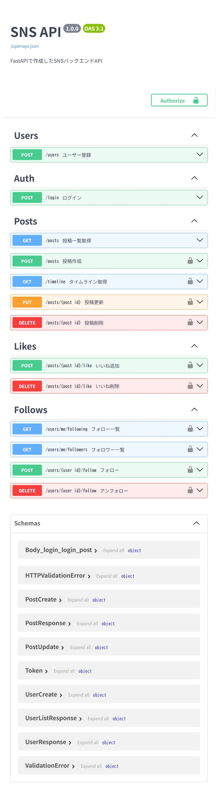

# SNS API

FastAPIを使用して作成したTwitter風なSNS APIです。

未経験からバックエンドエンジニアを目指す学習用として開発し、段階的に機能を追加しながら実装しました。

JWT認証・投稿機能・いいね・フォロー・タイムライン・検索機能などを実装しています。

---

# 使用技術

| 技術         | 内容              |
| ---------- | --------------- |
| Python     | 3.11            |
| FastAPI    | Web API フレームワーク |
| SQLAlchemy | ORM             |
| SQLite     | データベース          |
| JWT        | 認証              |
| Docker     | コンテナ化           |
| Uvicorn    | ASGIサーバー        |

---

# 機能一覧

## 認証

* ユーザー登録
* ログイン
* JWT認証

## 投稿

* 投稿作成
* 投稿一覧取得
* 投稿更新
* 投稿削除
* 投稿検索
* ページネーション

## SNS機能

* いいね
* フォロー
* タイムライン取得

## その他

* Swagger UI
* バリデーション
* CORS設定
* Docker対応
* 日本時間（JST）対応
* updated_at 自動更新

---

# ディレクトリ構成

```bash
sns-api/
├── app/
│   ├── main.py
│   ├── database.py
│   ├── models.py
│   ├── schemas.py
│   ├── auth.py
│   ├── dependencies.py
│   └── routers/
│       ├── auth.py
│       ├── users.py
│       ├── posts.py
│       ├── likes.py
│       └── follows.py
│
├── data/
├── Dockerfile
├── docker-compose.yml
├── requirements.txt
├── .env
└── .gitignore
```

---

# ER図（簡易）

```text
User
 ├── Post
 ├── Like
 └── Follow
```

---

# API一覧

## Auth

| Method | Endpoint  | 内容     |
| ------ | --------- | ------ |
| POST   | /register | ユーザー登録 |
| POST   | /login    | ログイン   |

---

## Posts

| Method | Endpoint    | 内容       |
| ------ | ----------- | -------- |
| GET    | /posts      | 投稿一覧取得   |
| POST   | /posts      | 投稿作成     |
| PUT    | /posts/{id} | 投稿更新     |
| DELETE | /posts/{id} | 投稿削除     |
| GET    | /timeline   | タイムライン取得 |

---

## Likes

| Method | Endpoint         | 内容  |
| ------ | ---------------- | --- |
| POST   | /likes/{post_id} | いいね |

---

## Follows

| Method | Endpoint          | 内容   |
| ------ | ----------------- | ---- |
| POST   | /follow/{user_id} | フォロー |

---

# 検索機能

```bash
GET /posts?keyword=python
```

投稿内容を部分一致で検索できます。

---

# ページネーション

```bash
GET /posts?limit=10&offset=0
```

| パラメータ  | 内容   |
| ------ | ---- |
| limit  | 取得件数 |
| offset | 開始位置 |

---

# バリデーション

以下の入力制限を実装しています。

* username: 3〜20文字
* password: 6文字以上
* post content: 1〜280文字

---

# ローカル起動方法

## 1. クローン

```bash
git clone <your-repository-url>
cd sns-api
```

---

## 2. 環境変数作成

`.env`

```env
SECRET_KEY=your_secret_key
ALGORITHM=HS256
ACCESS_TOKEN_EXPIRE_MINUTES=60
```

---

## 3. Docker起動

```bash
docker-compose up --build
```

---

# Swagger UI

```text
http://localhost:8000/docs
```

---

## Swagger スクリーンショット



---

# 工夫した点

- JWT認証を実装し、ログインユーザーのみ投稿・更新・削除可能にした
- Docker化することで、環境構築を簡単にした
- Like / Follow / Timeline 機能を実装し、SNSらしい設計にした
- Paginationを追加し、大量データ取得時の負荷を考慮した
- Swaggerのsummary と tags を整理してAPIドキュメントを見やすくした
- バリデーションを追加して不正な入力を防止した
- created_at / updated_at を日本時間（JST）対応にした
- 検索機能を追加し、投稿を部分一致検索できるようにした
- routers フォルダへ責務分割し、保守しやすい構成にした

---

# 学んだこと

* REST API設計
* JWT認証
* SQLAlchemyによるDB操作
* FastAPIによるバリデーション
* Dockerによる開発環境構築
* タイムライン設計
* ページネーション
* 検索機能
* CORS設定

---

# 今後追加したい機能

* Next.js フロントエンド
* プロフィール機能
* 画像投稿
* デプロイ
* テストコード

---

# その他

バックエンドエンジニアを目指して学習中です。
FastAPIを使用してSNS APIを開発しました。